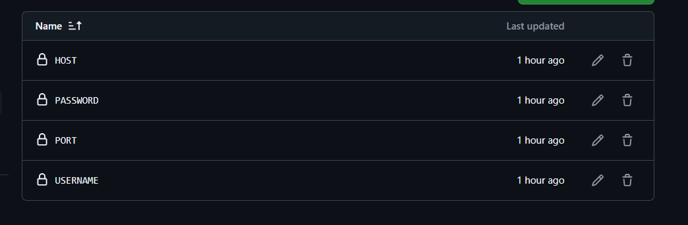
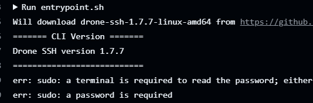

# Github-Action-Host
Fork untuk digunakan
Workflow ini menganut sistem [appleboy/ssh-action@v1.1.0](https://github.com/appleboy/ssh-action)

# Persiapkan Secrets di settings repo

# Login menggunakan Secrets

**selanjutnya bisa di konfigurasi sesuai kebutuhan**
**INGAT SAYA HANYA BELAJAR**